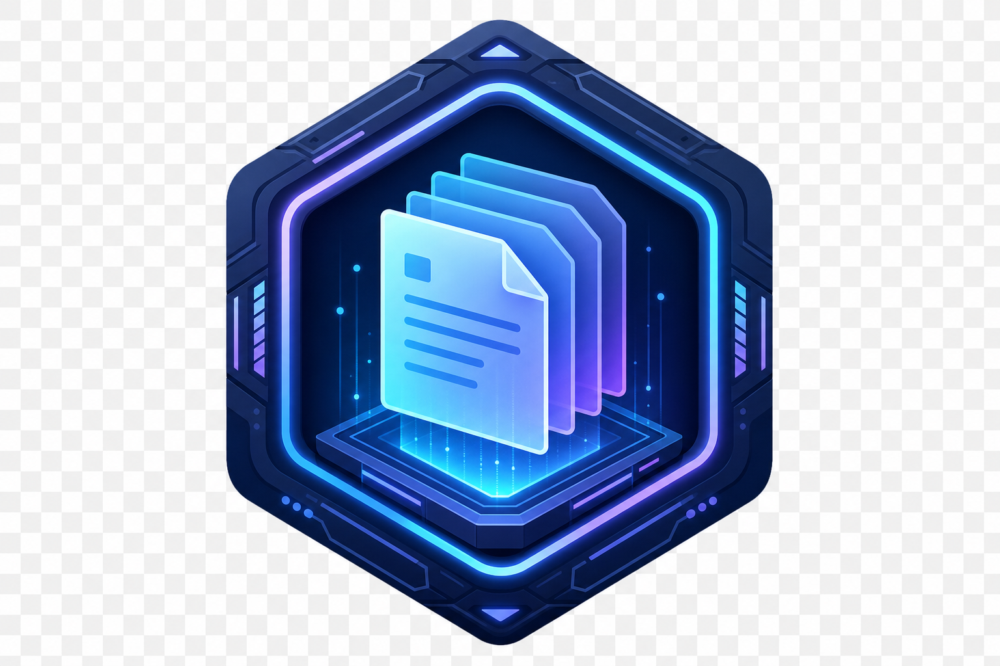

<div align="center">

# TODO Assistant · 留档助手

**本地优先的 Bug / 待办 / 需求 / 灵感 归档工作台**

极简毛玻璃界面 · Markdown · 看板 · 定时提醒 · WebDAV · Electron 桌面增强

[](LICENSE)
[](https://www.electronjs.org/)
[](https://github.com/kylian-08/TODO_Assistant)

[功能亮点](#-功能亮点) · [快速开始](#-快速开始) · [桌面版](#-electron-桌面版) · [项目结构](#-项目结构) · [作者](#-作者)



</div>

---

## ✨ 功能亮点

| 模块 | 说明 |
|------|------|
| **四类留档** | Bug · 待办 · 需求 · 灵感，独立配色与筛选 |
| **富文本内容** | Markdown 编辑 / 预览，Bug 一键模板 |
| **附件** | 图片拖放 / 粘贴截图，`.txt` `.log` `.md` 等文本附件 |
| **视图** | 列表 + 看板拖拽，置顶 / 完成 / 多维度筛选 |
| **版本历史** | 每次编辑自动存档，最多保留 30 个历史版本 |
| **草稿** | 表单自动保存，意外关闭可恢复 |
| **定时提醒** | 指定时间或「N 分钟后」，到期 Windows 系统通知 |
| **同步备份** | JSON 导入导出，WebDAV（坚果云等），每日自动导出 |
| **桌面增强** | 系统托盘、悬浮球、快捷留档面板、深色模式 |

---

## 🖥 界面预览

> 浅色毛玻璃 + 科幻六边形品牌标识，支持深色模式全局同步（含悬浮球 / 快捷面板）。

```
┌─────────────────────────────────────────────────────────────┐
│  TODO Assistant          [列表|看板]  [主题] [设置] [导出]   │
├──────────────┬──────────────────────────────────────────────┤
│  新建留档     │  留档列表 · 统计 · 筛选 · 搜索              │
│  类型/项目    │  ┌──────────────────────────────────────┐  │
│  标题/标签    │  │ ⏰ Bug · 高 · 待处理                  │  │
│  Markdown    │  │ 修复登录页样式错位…                    │  │
│  提醒/附件    │  └──────────────────────────────────────┘  │
└──────────────┴──────────────────────────────────────────────┘
```

---

## 🚀 快速开始

### 环境要求

- [Node.js](https://nodejs.org/) 18+
- Windows 10/11（桌面版打包；浏览器版跨平台）

### 安装与运行

```bash
git clone https://github.com/kylian-08/TODO_Assistant.git
cd TODO_Assistant
npm install
npm start          # Electron 桌面版
```

### 浏览器版（零依赖）

直接用浏览器打开根目录 `index.html` 即可使用核心功能（不含托盘 / 悬浮球）。

### 打包 Windows 可执行文件

```bash
npm run build
```

| 输出 | 路径 |
|------|------|
| 绿色版 EXE | `dist/win-unpacked/TODO_Assistant.exe` |
| 便携 ZIP | `dist/TODO_Assistant-1.0.0-win-x64.zip` |

也可双击 **`构建EXE.bat`** 一键清理、打包并生成 ZIP。

安装包（需网络下载 NSIS）：

```bash
npm run build:installer
```

---

## 🪟 Electron 桌面版

| 操作 | 说明 |
|------|------|
| **左键单击悬浮球** | 打开主窗口 |
| **长按悬浮球** | 打开快速留档面板 |
| **右键悬浮球** | 菜单：主窗口 / 快速留档 / 隐藏 / 退出 |
| **关闭主窗口** | 默认收起到系统托盘（可在设置中修改） |
| **双击托盘图标** | 显示主窗口 |

### 定时提醒

1. 新建留档时勾选 **设置提醒**
2. 选择 **指定时间** 或 **N 分钟后**
3. 保存后，到期弹出 **Windows 原生通知**（点击通知打开主窗口）

---

## ⌨️ 快捷键

| 按键 | 功能 |
|------|------|
| `Ctrl + S` | 保存当前留档 |
| `Ctrl + V` | 在内容区粘贴截图（自动作为附件） |

---

## 🗂 项目结构

```
TODO_Assistant/
├── index.html          # 主界面
├── float-ball.html     # 悬浮球
├── float-panel.html    # 快捷留档面板
├── css/                # 样式（毛玻璃 / 深色模式）
├── js/
│   ├── app.js          # 核心业务逻辑
│   ├── markdown.js     # Markdown 渲染
│   └── theme-sync.js   # 跨窗口主题同步
├── electron/
│   ├── main.js         # 托盘 / 通知 / 悬浮窗
│   └── preload.js      # 安全 IPC 桥接
└── assets/             # 图标与品牌资源
```

---

## 🛠 技术栈

- **数据层**：IndexedDB（离线本地存储，无需后端）
- **UI**：原生 HTML / CSS / JavaScript
- **桌面**：Electron 33 + electron-builder
- **同步**：WebDAV（Basic Auth）

---

## 🤝 贡献

欢迎提交 Issue 与 Pull Request。Fork → 分支 → 提交 → PR。

---

## 📄 许可证

本项目采用 [MIT License](LICENSE) 开源。

---

## 👤 作者

**[kylian-08](https://github.com/kylian-08)**

如果这个项目对你有帮助，欢迎点个 **Star** ⭐
